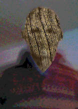

wooden-head-hsb-notifier
========================

Copyright ©2016 Craig Parker-Feldmann

## Description

A very simple Lua shell script, which reports whether the
Hackerspace Bremen is open or not.

## Algorithm

This shell script invokes lua, which executes a call to the operating system. That call invokes `curl` in order to query the Hackerspace Bremen website.

It processes the resulting JSON stream with the program `jshon`.

<!-- Local Variables: -->
<!-- mode: markdown -->
<!-- tab-width: 4 -->
<!-- End: -->

<!-- EOF -->
